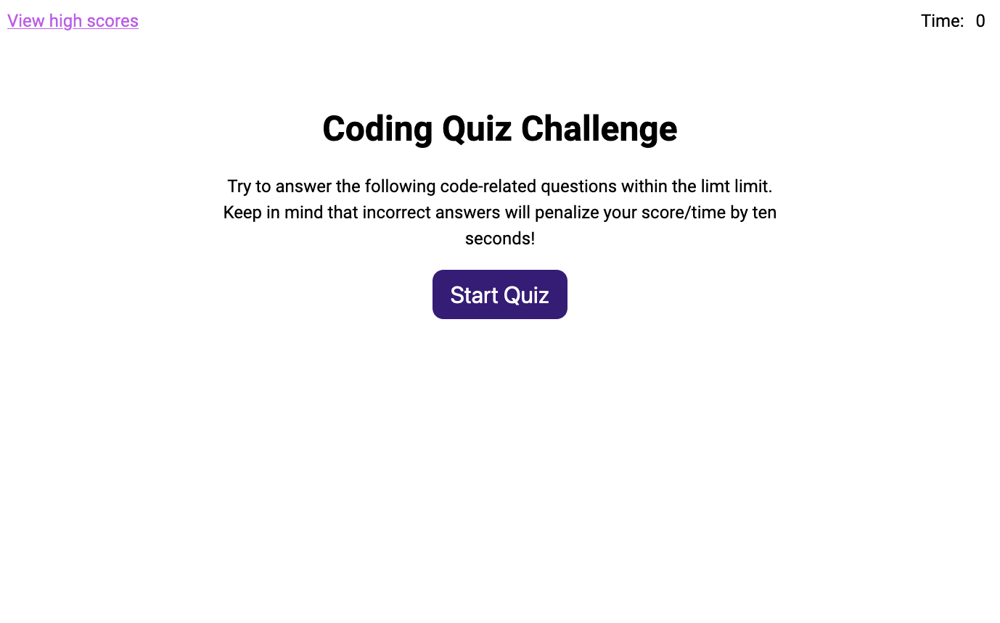

# Quizinator

## Description
The Quizinator is for JavaScript developers to test their knowledge and save their high scores!

## Usage
Click the 'Start Quiz' button and answer the questions to the best of your ability. If you finish the quiz before the time runs out, you can save your score. At the end of the game, regardless of win status, you can choose to start the quiz over from the start.

## Credits
[Stack Overflow](https://stackoverflow.com/)

[W3 Schools](https://www.w3schools.com/)

## Live Site
[Quizinator](https://brookescodestuff.github.io/quizinator/)

## Screenshot

